# Migration de l'Haplogroupe Y - De Y-Adam à Luc

Une visualisation interactive et animée du parcours migratoire de l'haplogroupe Y depuis Y-Adam (il y a ~236 000 ans) jusqu'à un individu moderne nommé Luc, situé dans le centre de la France.

## 🌐 Application en Ligne

**[🚀 Accéder à l'application interactive](https://l0d0v1c.github.io/L20/)**

Explorez la migration de l'haplogroupe Y directement dans votre navigateur avec zoom automatique, animation fluide et contrôles interactifs.

## 📊 Aperçu



> **Note**: L'animation SVG ci-dessus se lance automatiquement dans les navigateurs modernes. Si vous ne voyez pas l'animation, ouvrez le fichier SVG directement dans votre navigateur.

## 🎯 Description

Ce projet trace l'évolution génétique et géographique d'une lignée paternelle à travers 33 étapes clés, couvrant :

- **236 000 ans** d'histoire humaine
- **6 périodes historiques** : Paléolithique, Mésolithique, Néolithique, Âge du Bronze, Âge du Fer, Époque Contemporaine
- **3 continents** : Afrique, Asie, Europe
- **33 haplogroupes** successifs, du plus ancestral (Y-Adam) au plus récent (R1b1a1b1a1a2a - DF27/S250)

## 🗺️ Étapes Clés

### Origines Africaines (Paléolithique)
- **Y-Adam** (~236 000 ans) - Afrique Centrale/Est
- Expansion en Afrique de l'Est et du Sud
- Sortie d'Afrique (~70 000 ans)

### Migration Asiatique (Paléolithique)
- Installation au Proche-Orient (~65 000 ans)
- Expansion en Asie Centrale et Sibérie
- Formation de l'haplogroupe R (~28 000 ans)

### Expansion Européenne (Mésolithique - Néolithique)
- Passage par le Caucase et l'Anatolie
- Expansion néolithique en Europe centrale (~10 000 ans)
- Installation en Europe de l'Ouest (~6 500 ans)

### Période Historique (Âge du Bronze - Âge du Fer)
- Culture du vase campaniforme (~5 500 ans)
- Mutation DF27/S250 (~4 000 ans)
- **La Tène** (~450 av. J.-C.) - Culture celtique en Suisse

### Époque Contemporaine
- **Luc** - Centre de la France (Aujourd'hui)

## 🛠️ Fichiers du Projet

- **`carte_migration.html`** : Carte interactive principale avec contrôles de navigation et zoom automatique
- **`position_tool.html`** : Outil pour positionner les points sur la carte
- **`position_tool_zoom.html`** : Version améliorée avec contrôles de zoom
- **`verification_tool.html`** : Outil de vérification de cohérence du parcours migratoire
- **`carte.jpg`** : Image de fond de la carte du monde
- **`Classification.lineageresult.txt`** : Données brutes de la lignée de l'haplogroupe Y
- **`migration_haplogroupe_Y_animé.svg`** : Export SVG animé de la migration

## 🚀 Utilisation

### Carte Interactive

1. Ouvrez `carte_migration.html` dans votre navigateur
2. Utilisez les contrôles :
   - **▶ Lecture** : Lance l'animation automatique
   - **← Précédent / Suivant →** : Navigation manuelle entre les étapes
   - **⟳ Recommencer** : Retour au début
   - **👁️ Légendes** : Affiche/masque les légendes
   - **💾 Export SVG animé** : Génère un fichier SVG autonome
   - **Vitesse** : Ajuste la vitesse d'animation (Lente/Normale/Rapide)

### Fonctionnalités

- **Zoom automatique** : La carte zoome sur la région active
- **Animation fluide** : Transitions douces entre les étapes
- **Périodes historiques** : Affichées sur la barre de progression
- **Points pulsants** : Le point actuel pulse pour attirer l'attention
- **Informations détaillées** : Panneau d'information avec haplogroupe, localisation, date et description

### Export SVG Animé

1. Cliquez sur le bouton "💾 Export SVG animé"
2. Le fichier `migration_haplogroupe_Y_animé.svg` sera téléchargé
3. Ouvrez-le dans un navigateur pour voir l'animation (66 secondes, 2s par étape)
4. Le SVG peut être intégré dans des présentations, sites web, etc.

## 📋 Données Techniques

### Haplogroupes Couverts

```
Y-Adam → A000T → A00T → A0T → A1 → A1b → BT → CT → CF → F →
GHIJK → HIJK → IJK → K → K2 → K2b → P → P1 → R → R1 → R1b →
R1b1 → R1b1a → R1b1a1 → R1b1a1b → R1b1a1b1 → R1b1a1b1a →
R1b1a1b1a1 → R1b1a1b1a1a → R1b1a1b1a1a2 → R1b1a1b1a1a2a (DF27) →
La Tène → Luc
```

### Périodes Chronologiques

| Période | Étapes | Années |
|---------|--------|--------|
| **Paléolithique** | 1-22 | ~236 000 - ~18 000 ans |
| **Mésolithique** | 23-24 | ~13 000 - ~10 000 ans |
| **Néolithique** | 25-26 | ~8 000 - ~6 500 ans |
| **Âge du Bronze** | 27-30 | ~5 500 - ~4 000 ans |
| **Âge du Fer** | 31 | ~450 av. J.-C. |
| **Époque Contemporaine** | 32 | Aujourd'hui |

### Régions Géographiques

- **Afrique** : Étapes 1-7 (Zoom 2.5x)
- **Asie** : Étapes 8-20 (Zoom 2.0x)
- **Europe** : Étapes 21-33 (Zoom 3.5x)

## 🎨 Palette de Couleurs

Les couleurs évoluent du rouge (origines africaines) au magenta (époque moderne) :

- Rouge/Orange : Afrique (Y-Adam, premières mutations)
- Jaune/Vert : Sortie d'Afrique, Asie
- Cyan/Bleu : Sibérie, Europe
- Violet/Magenta : Europe de l'Ouest, période moderne

## 🔧 Technologies Utilisées

- **HTML5** : Structure de la page
- **CSS3** : Styles et animations
- **JavaScript (Vanilla)** : Logique d'animation et interaction
- **SVG** : Overlay vectoriel pour les points et lignes
  - `viewBox="0 0 1 1"` pour coordonnées normalisées
  - Animations SMIL pour l'export
- **Canvas API** : (dans les versions précédentes, remplacé par SVG)

## 📖 Contexte Scientifique

### L'Haplogroupe Y

L'haplogroupe Y fait référence aux lignées génétiques transmises de père en fils via le chromosome Y. Chaque haplogroupe représente une mutation spécifique qui s'est produite à un moment donné de l'histoire humaine.

### Y-Adam

Y-Adam (ou Adam chromosomique) est le plus récent ancêtre commun patrilinéaire de tous les humains vivants. Il a vécu il y a environ 236 000 ans en Afrique Centrale ou de l'Est.

### R1b1a1b1a1a2a (DF27/S250)

Cet haplogroupe est particulièrement fréquent dans la péninsule Ibérique et le sud-ouest de la France. La mutation DF27/S250 date d'environ 4 000 ans et est associée aux populations de l'Âge du Bronze atlantique.

### La Tène

La culture de La Tène (Second Âge du Fer, ~450 av. J.-C.) représente l'apogée de la civilisation celtique en Europe centrale et occidentale. Le site éponyme se trouve en Suisse.

## 🤝 Contribution

Ce projet a été développé pour visualiser une lignée génétique personnelle. Les données proviennent de tests ADN et de recherches généalogiques génétiques.

## 📝 Licence

Ce projet est fourni à des fins éducatives et de visualisation personnelle.

## 🔗 Ressources

- [ISOGG (International Society of Genetic Genealogy)](https://isogg.org/)
- [YFull YTree](https://www.yfull.com/tree/)
- [Eupedia - Haplogroups](https://www.eupedia.com/europe/origins_haplogroups_europe.shtml)

---

**Généré avec [Claude Code](https://claude.com/claude-code)** 🤖
